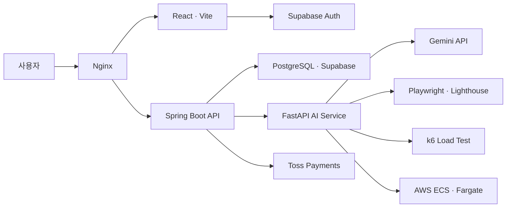

<div align="center">
  

  <p><strong>URL 하나로 시작하는 AI 성능·UI/UX 테스트 플랫폼</strong></p>
  <p>복잡한 스크립트 없이 웹 서비스의 성능과 사용성을 자동으로 검증합니다.</p>

  <p>
    <a href="https://flowcheck.kr">서비스 바로가기</a>
    ·
    <a href="#핵심-기능">핵심 기능</a>
    ·
    <a href="#로컬-실행">실행 방법</a>
  </p>
</div>

---

## 프로젝트 소개

웹 서비스의 품질을 검증하려면 부하 테스트 스크립트 작성, 브라우저 기반 사용성 테스트, 결과 분석을 각각 수행해야 합니다.

**FlowCheck**는 URL과 테스트 조건만 입력하면 AI가 부하 테스트와 UI/UX 테스트를 실행하고, 측정 결과와 개선 방향을 이해하기 쉬운 보고서로 제공하는 통합 테스트 플랫폼입니다. 완료된 테스트는 이력으로 관리하고 커뮤니티에 공유할 수 있습니다.

## 핵심 기능

| 기능 | 설명 |
| --- | --- |
| **AI 부하 테스트** | 입력한 URL과 실행 조건을 바탕으로 k6 테스트를 생성하고 응답 시간, 처리량, 오류율을 분석합니다. |
| **AI UI/UX 감사** | Gemini와 Playwright 기반 에이전트가 브라우저를 자율 탐색하고 사용성 결함과 개선 근거를 영상·점수·보고서로 제공합니다. |
| **실시간 진행 상황** | 오래 걸리는 테스트의 상태와 진행 데이터를 실시간 스트림으로 확인할 수 있습니다. |
| **사이트 검증 및 이력 관리** | 테스트할 사이트를 등록·검증하고 완료된 테스트 결과를 대시보드와 마이페이지에서 다시 확인합니다. |
| **커뮤니티** | 검증한 사이트와 테스트 결과를 게시글로 공유하고 댓글과 좋아요로 소통합니다. |
| **크레딧 결제** | Toss Payments로 크레딧을 충전하고 필요한 테스트만 사용량 기반으로 실행합니다. |
| **관리자 기능** | 사용자 상태, 문의 내역, 서비스 통계를 통합 관리합니다. |

## 서비스 동작 흐름

1. 사용자가 테스트할 사이트를 등록하고 소유권을 검증합니다.
2. 부하 테스트 또는 UI/UX 테스트를 선택하고 실행 조건을 입력합니다.
3. Spring Boot가 요청과 크레딧을 검증한 뒤 FastAPI AI 서비스에 작업을 전달합니다.
4. AI 서비스가 k6 또는 Playwright 기반 테스트를 실행하고 진행 상황과 결과를 반환합니다.
5. 사용자는 분석 보고서를 확인하고 테스트 이력 또는 커뮤니티에 결과를 공유합니다.

## 시스템 아키텍처



## 기술 스택

| 구분 | 기술 |
| --- | --- |
| **Frontend** | React 19, TypeScript, Vite, Zustand, Recharts |
| **Backend** | Java 21, Spring Boot 3.4, Spring Security, Spring Data JPA, WebSocket |
| **AI / Test** | FastAPI, Gemini API, Playwright, Lighthouse, k6 |
| **Database / Auth** | PostgreSQL, Supabase |
| **Payment** | Toss Payments |
| **Infrastructure** | Docker, Nginx, AWS EC2, ECS/Fargate, S3 |
| **CI/CD** | GitHub Actions |

## 프로젝트 구조

```text
flowcheck/
├── frontend/                 # React 사용자·관리자 웹 애플리케이션
│   └── src/
│       ├── api/              # 백엔드 API 클라이언트
│       ├── components/       # 공통 및 도메인 UI 컴포넌트
│       ├── pages/            # 라우트 단위 화면
│       ├── store/            # Zustand 전역 상태
│       └── styles/           # 공통 토큰과 화면 스타일
├── backend/                  # Spring Boot API 서버
│   └── src/main/
│       ├── java/com/flowcheck/
│       │   ├── controller/   # REST API 엔드포인트
│       │   ├── service/      # 비즈니스 로직
│       │   ├── repository/   # JPA 데이터 접근 계층
│       │   └── security/     # 인증·인가 및 계정 상태 정책
│       └── resources/db/     # 데이터베이스 초기화·운영 SQL
├── ai/                       # FastAPI AI 테스트 오케스트레이터
│   ├── load_test/            # 부하 테스트 생성·실행·분석 파이프라인
│   └── tests/                # AI 및 분석 로직 단위 테스트
├── .github/workflows/        # 서비스별 빌드·배포 워크플로
├── docker-compose.yml        # 운영 컨테이너 구성
└── nginx.conf                # HTTPS 및 API 리버스 프록시 설정
```

## 로컬 실행

### 요구 사항

- Node.js 24, npm 11
- Java 21
- Python 3.11
- PostgreSQL 또는 Supabase 프로젝트
- Docker Desktop (로컬 UI/UX 워커 실행 시)

### 환경 변수

루트 디렉터리에 `.env` 파일을 만들고 실행 환경에 맞는 값을 설정합니다. 실제 키와 비밀번호는 저장소에 커밋하지 않습니다.

```dotenv
# Database
DB_HOST=localhost
DB_PORT=5432
DB_NAME=flowcheck
DB_USER=postgres
DB_PASSWORD=your_password

# Supabase
SUPABASE_URL=your_supabase_url
SUPABASE_ANON_KEY=your_supabase_anon_key
SUPABASE_JWKS_URL=your_supabase_jwks_url
SUPABASE_JWT_KEY=your_supabase_jwt_key
VITE_SUPABASE_URL=your_supabase_url
VITE_SUPABASE_ANON_KEY=your_supabase_anon_key

# AI services
GEMINI_API_KEY=your_gemini_api_key
FASTAPI_URL=http://localhost:8000
LOAD_TEST_CALLBACK_TOKEN=replace_with_a_random_secret
UIUX_TEST_CALLBACK_TOKEN=replace_with_a_random_secret
USE_FARGATE=false

# Payment
TOSS_WIDGET_CLIENT_KEY=your_toss_client_key
TOSS_WIDGET_SECRET_KEY=your_toss_secret_key
```

AWS ECS/Fargate에서 테스트를 실행할 때는 `AWS_REGION`, `S3_BUCKET`, `ECS_CLUSTER`, `ECS_TASK_FAMILY`, `ECS_SUBNET_ID`, `ECS_SECURITY_GROUP_ID` 등의 배포 환경 변수도 필요합니다.

### 1. AI 서버

```bash
cd ai
python -m venv .venv
```

Windows PowerShell:

```powershell
.\.venv\Scripts\Activate.ps1
pip install -r requirements.txt
npm install
playwright install chromium
uvicorn main:app --reload --port 8000
```

macOS 또는 Linux:

```bash
source .venv/bin/activate
pip install -r requirements.txt
npm install
playwright install chromium
uvicorn main:app --reload --port 8000
```

### 2. 백엔드

Windows PowerShell:

```powershell
cd backend
.\gradlew.bat bootRun
```

macOS 또는 Linux:

```bash
cd backend
./gradlew bootRun
```

백엔드는 `http://localhost:8080`에서 실행되며 Swagger UI는 `http://localhost:8080/swagger-ui/index.html`에서 확인할 수 있습니다.

### 3. 프론트엔드

```bash
cd frontend
npm install
npm run dev
```

브라우저에서 `http://localhost:5173`으로 접속합니다. 개발 서버는 `/api` 요청을 `http://localhost:8080`으로 프록시합니다.

## 테스트

```bash
# Frontend 정적 검사 및 빌드
cd frontend
npm run lint
npm run build

# Backend 테스트
cd backend
./gradlew test

# AI 단위 테스트
cd ai
python -m unittest discover -s tests -v
```

## 배포

서비스는 GitHub Actions를 통해 프론트엔드, 백엔드, AI 이미지를 빌드하고 Docker Hub에 게시한 뒤 AWS 환경에 배포합니다. 운영 트래픽은 Nginx가 HTTPS 종료, API 프록시, SSE 및 WebSocket 연결을 담당합니다.

운영 배포에는 다음 항목이 추가로 필요합니다.

- 운영 도메인과 Let's Encrypt 인증서
- Docker Hub 인증 정보
- AWS EC2 및 ECS/Fargate 접근 정보
- Supabase, Gemini, Toss Payments 운영 키
- 내부 콜백 검증용 토큰

## 운영 및 데이터베이스 설정

### Supabase 비밀번호 재설정 URL

비밀번호 재설정 메일이 올바른 화면으로 돌아오도록 Supabase Dashboard의 `Authentication > URL Configuration`에 다음 값을 등록합니다.

- Site URL: `https://flowcheck.kr`
- Redirect URLs
  - `http://localhost:5173/reset-password`
  - `https://flowcheck.kr/reset-password`

운영 도메인이 변경되면 Site URL과 운영 Redirect URL을 실제 주소로 함께 변경합니다. 이메일 템플릿을 직접 수정한 경우에는 링크가 `{{ .SiteURL }}`이 아니라 `{{ .RedirectTo }}`를 사용하도록 확인합니다.

### 닉네임 정책

닉네임 기능을 사용하기 전에 Supabase SQL Editor에서 `backend/src/main/resources/db/manual/user_nickname.sql`을 실행해야 합니다.

닉네임은 2~20자의 한글, 영문, 숫자, 밑줄만 사용할 수 있으며 대소문자를 구분하지 않고 중복을 막습니다. SQL은 기존 Supabase 회원 메타데이터의 유효한 닉네임을 `public.users`로 이전하고, 새 이메일 회원가입 시 닉네임을 동기화하는 트리거를 설치합니다.

### 계정 상태 정책

| 상태 | 의미 |
| --- | --- |
| `ACTIVE` | 정상 이용 계정 |
| `SUSPENDED` | 관리자가 7일 동안 정지한 계정이며 만료 후 자동 활성화 |
| `DEACTIVATED` | 사용자가 직접 비활성화한 계정이며 다음 로그인 때 본인이 재활성화 가능 |
| `BLOCKED` | 관리자가 차단한 계정이며 관리자만 차단 해제 가능 |
| `WITHDRAWN` | 실제 회원 탈퇴 처리용 예약 상태 |

계정 상태 기능을 사용하기 전에 Supabase SQL Editor에서 `backend/src/main/resources/db/manual/account_status_policy.sql`을 실행해야 합니다. 이 SQL은 기존 `WITHDRAWN` 계정을 관리자 해제가 가능한 `BLOCKED` 상태로 한 번 이전합니다.

## Roadmap

### 실제 회원 탈퇴

현재 사용자 메뉴는 데이터 삭제가 아닌 **계정 비활성화** 기능입니다. 실제 회원 탈퇴는 다음 정책과 구현이 추가로 필요합니다.

1. 백엔드 관리자 권한으로 Supabase Auth 사용자를 삭제합니다. `service_role` 키는 프론트엔드에 노출하지 않습니다.
2. 법적 보관 의무가 없는 프로필·커뮤니티 개인정보를 삭제하거나 익명화합니다.
3. 결제·계약 및 문의·분쟁 기록은 관련 법령과 개인정보처리방침에서 정한 기간만 보관한 뒤 파기합니다.
4. Supabase Storage의 `avatars` 버킷에서 사용자 프로필 이미지를 삭제합니다.
5. 재가입 허용 시점, 탈퇴 철회 기간, 동일 이메일 재사용 정책을 정하고 자동 테스트를 추가합니다.

> 일반적인 전자상거래 기준은 계약·결제 기록 5년, 소비자 불만·분쟁 기록 3년이지만 실제 적용 전 개인정보처리방침과 관련 법령을 다시 확인해야 합니다.
